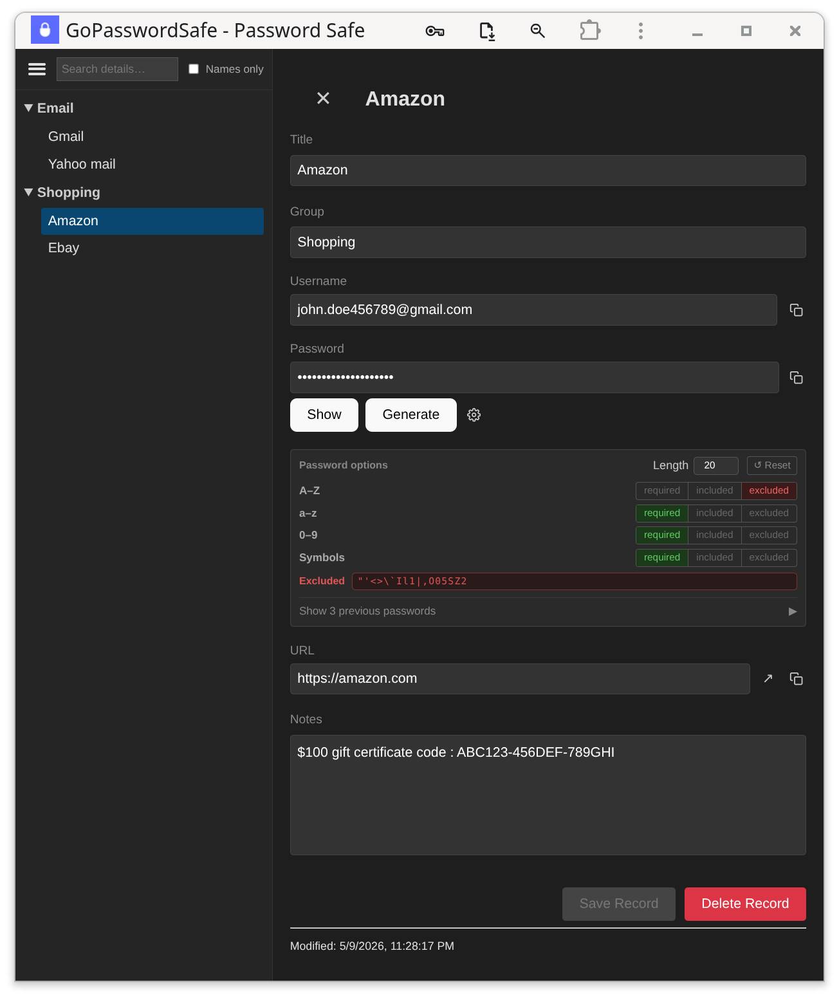

= gopwsafe
:toc:
:toc-placement: preamble

image:https://goreportcard.com/badge/github.com/tkuhlman/gopwsafe["Go Report Card",link="https://goreportcard.com/report/github.com/tkuhlman/gopwsafe"]
image:https://pkg.go.dev/badge/github.com/tkuhlman/gopwsafe.svg["Go Reference",link="https://pkg.go.dev/github.com/tkuhlman/gopwsafe"]

A password manager that runs cross-platform in your browser, reading and writing http://pwsafe.org/[Password Safe] v3 databases stored on your device.

*Free and open source.* Try it: https://dbro.github.io/gopwsafe

== Why yet another Password Safe app?

Cryptographer Bruce Schneier invented Password Safe in the 1990s, and it was open sourced in 2002. That means the database encryption is well-known and well-tested at this point; and there are multiple https://www.pwsafe.org/relatedprojects.shtml[password manager applications] that can read+write pwsafe format files (no vendor lock-in). However, those applications are a grab bag of single-platform offerings with overly complex user interfaces. The goal of gopwsafe is to be a new alternative that is
* *compatible* with all Password Safe v3 files and applications
* *cross-platform* for mobile and desktop use on all major operating systems,
* *focused* on the most common tasks (search, groups, generating passwords) without overloading the user interface,
* *keeping your data in your control* with everything running locally, and nothing shared with the server (database file, master password, sync credentials).

== Who is this for?

People who
* prefer to work with a local file to store the password database, NOT a hosted service such as 1Password or LastPass
* need to access the same password safe file on multiple platforms, including mobile devices, and possibly using different Password Safe apps
* need only these essential fields: *Group, Title, Username, Password, URL, Notes*
* do not need built-in autofill or TOTP code generation

== Features

gopwsafe offers a limited set of features, preferring to be a small app that is simple to operate and understand. These essential capabilities are:
* *search* to find items that contain specific search terms in their title field, or in all available fields
* browse *groups* of items
* *copy* values into the clipboard to later paste into login/password fields
* open a browser window and *visit the URL* of an item
* *generate random passwords* with settings for length and character sets
* *confirm changes* before saving a new version of the database file
* *password history* is automatically tracked

== How it works under the hood

gopwsafe runs entirely in your browser: a Go binary compiled to WebAssembly handles all cryptography and database parsing client-side, so your password database and master password never leave your device.
The Svelte frontend loads the WASM module, lets you open or create a `.psafe3` file from your local filesystem, and stores nothing remotely.
Because it is packaged as a Progressive Web App (PWA), it can be installed to your home screen (both mobile and desktop) and used fully offline.

== Installation

=== Install as a Web App (recommended)

Visit https://dbro.github.io/gopwsafe in a modern browser (Chrome, Edge, Firefox, or Safari).
Click the *Install* button that appears in your browser's address bar or the in-page install prompt to add gopwsafe to your home screen or app launcher. Once installed it works offline without any further setup.

=== Install via self-hosted server / compile from source

*Prerequisites:* Go 1.21+, Node.js 18+

1. Build the WebAssembly binary:
+
[source,bash]
----
GOOS=js GOARCH=wasm go build -ldflags="-X 'github.com/tkuhlman/gopwsafe/pwsafe.Version=$(git describe --tags --always)'" -o pwa/public/gopwsafe.wasm ./cmd/wasm/
----

2. Build and preview the frontend:
+
[source,bash]
----
cd pwa
npm install
npm run build
npm run preview
----

== Security notes

The app requires HTTPS (or localhost) for clipboard and filesystem access to work.

For an extra measure of security, install from a browser profile that has no extensions (or only extensions you fully trust). Browser extensions in the same profile can access page content, so a malicious extension could read your unlocked data. Because gopwsafe is a PWA, installing it once from a clean profile means launching it later is just opening an app — no extra friction day-to-day.

== Syncing database files remotely
By itself, gopwsafe does not copy or sync files with remote servers. It is possible to read and write to a local folder that has its files synced by other apps such as rclone, Google Drive, Dropbox, Syncthing, etc.

== References
- V3 Password Safe Specification - https://github.com/pwsafe/pwsafe/blob/master/docs/formatV3.txt

== See also
- The upstream repo from which this is forked: https://github.com/tkuhlman/gopwsafe
- There is a similar project for Keepass format database files: https://github.com/keeweb/keeweb which is also a PWA
